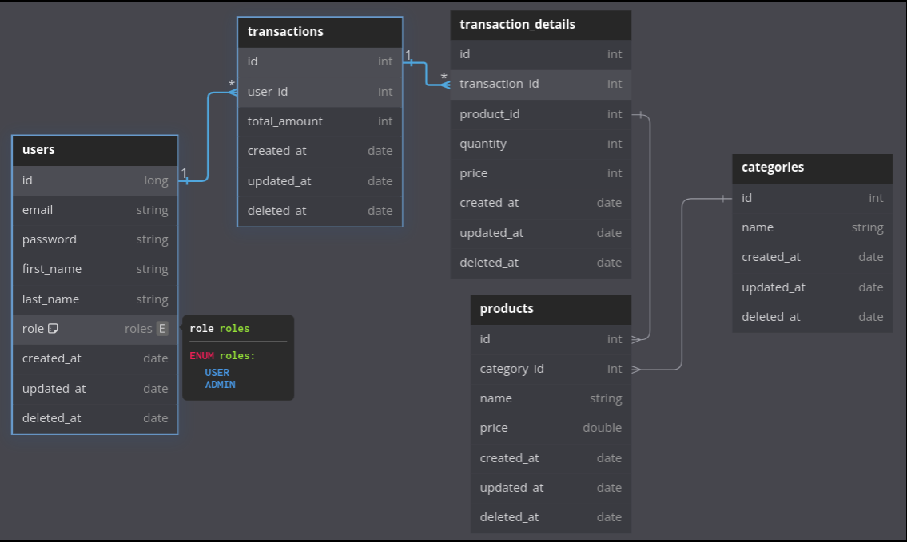

ERD


SEEDING 1000 products SQL Scripts
```
CREATE OR REPLACE FUNCTION random_string(length INTEGER) RETURNS TEXT AS
$$
DECLARE
chars TEXT := 'abcdefghijklmnopqrstuvwxyzABCDEFGHIJKLMNOPQRSTUVWXYZ0123456789';
result TEXT := '';
i INTEGER := 0;
BEGIN
FOR i IN 1..length LOOP
result := result || substr(chars, floor(random() * length(chars) + 1)::INTEGER, 1);
END LOOP;
RETURN result;
END;
$$ LANGUAGE plpgsql;

-- Insert 1000 products
INSERT INTO products (name, price, category_id, created_at, updated_at, discarded_at)
SELECT
'Product ' || random_string(10) AS name,
(random() * 1000 + 1)::numeric(10,2) AS price,
1 AS category_id,
NOW() AS created_at,
NOW() AS updated_at,
NULL AS discarded_at
FROM generate_series(1, 30000);
```